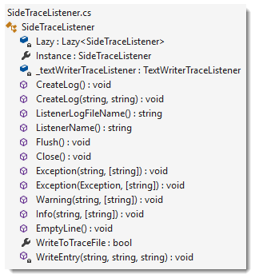

# TraceListener sample

### LogLibrary  
- SideTraceListener thread safe class wrapper for [TextWriterTraceListener](https://docs.microsoft.com/en-us/dotnet/api/system.diagnostics.textwritertracelistener?view=netframework-4.8) as a singleton (Ensure a class has only one instance and provide a global point of access to it.) to write informational and exception information across domains in a C# solution, in this case SIDES UIPortal.
- Logger class, base for SideTraceListener, not used. 

### FileOperations
Used to test trace SideTraceListener in another namespace for recording runtime exceptions.

### GeneralExperimentsWithTrace

Test
- Initialize and finalize of SideTraceListener
- Calling test methods